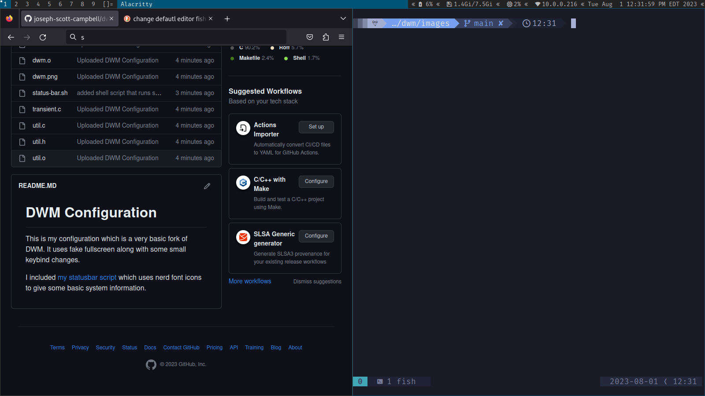

# DWM Configuration

This is my configuration which is a very basic fork of DWM. It uses fake fullscreen along with some small keybind changes.

I included [my statusbar script](https://github.com/joseph-scott-campbell/dwm/blob/main/status-bar.sh) which uses nerd font icons to give some basic system information.

If you have available compute resources I don't recommend using this configuration. I simply use this because my laptop can not run smoothly with more user friendly desktop environments.
